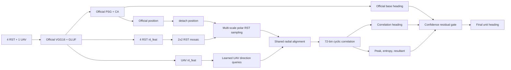

# Experiment H2: Improved MS-PCOC Heading Correlation

## 1. Goal

Experiment H2 adds a Multi-Scale Position-Conditioned Orientation Correlation
(MS-PCOC) head to the official `PARCASGM_v5a` baseline. The official position
and heading paths are retained. The new head uses the predicted position to
sample local RST evidence and predicts a 72-bin circular heading distribution.

Model class and result prefix:

```text
PARCASGM_v5a_MSPCOC
phr5_h2_mspcoc
```

Unlike a planar polar warp of the oblique UAV image, H2 uses learned UAV
direction queries and a shared virtual radial alignment. Only the RST mosaic is
sampled in polar coordinates.



## 2. Supervision

No new annotation is required. `RSBlockDatasetPA_v3q` already returns:

```python
agl_coords = [cos(theta_gt), sin(theta_gt)]
```

H2 converts this vector to a von Mises soft target over 72 bins at training
time. The heading objective is:

```text
L_heading = L_VMCE + 0.5 * L_corr + 0.5 * L_final
L_total   = 0.8 * L_position + 0.2 * L_heading
```

- `L_VMCE`: cross entropy against a von Mises circular target (`kappa=32`).
- `L_corr`: wrapped Smooth L1 angular loss on the correlation heading.
- `L_final`: wrapped Smooth L1 angular loss after confidence gating.

The position passed to MS-PCOC is detached. In the default stage-one setup the
entire official baseline is frozen, including its BatchNorm/evaluation state.

## 3. Download code, data, and baseline weights

Clone the personal experiment repository:

```bash
git clone https://github.com/baoli-haixian/bearing-uav.git
cd bearing-uav
```

Download the official dataset and model files:

- Dataset: https://huggingface.co/datasets/HaoyZhou/bearinguav/tree/main
- Model weights: https://huggingface.co/HaoyZhou/bearinguav/tree/main

After extraction, the important paths should be:

```text
bearinguav/
├── Bearing_UAV_90K/
│   ├── citya/
│   ├── cityb/
│   ├── cityc/
│   ├── cityd/
│   └── c4m_254k_96bc_b15_s100_v3d/
│       └── metadata/metadata.csv
└── Bearing_UAV/
    └── cross_view/best_model.pth
```

`--init_checkpoint` should point to the fair experiment A checkpoint trained
with the same split and preprocessing. The official `cross_view/best_model.pth`
can be used for a compatibility run, but experiment claims should compare H2
against the exact checkpoint used to initialize H2.

Check all indexed image paths before training:

```bash
python -c "import os,pandas as pd; p='Bearing_UAV_90K/c4m_254k_96bc_b15_s100_v3d/metadata/metadata.csv'; d=pd.read_csv(p); c=['p1_path','p2_path','p3_path','p4_path','target_path']; m=[x for k in c for x in d[k] if not os.path.isfile(x)]; print('rows=',len(d),'missing=',len(m)); print(*m[:20],sep='\n')"
```

Do not start training unless `missing=0`.

## 4. Environment

Use the same environment as the official baseline:

```bash
conda create -n bearing_env python=3.9 -y
conda activate bearing_env
pip install torch==2.1.2 torchvision==0.16.2 torchaudio==2.1.2 \
  --index-url https://download.pytorch.org/whl/cu118
pip install -r requirements.txt
export PYTHONPATH=$(pwd):${PYTHONPATH}
export TORCH_HOME=$(pwd)/.cache/torch
```

Cache the ImageNet VGG-16 weights if the compute node is offline:

```bash
mkdir -p ${TORCH_HOME}/hub/checkpoints
curl -L -o ${TORCH_HOME}/hub/checkpoints/vgg16-397923af.pth \
  https://download.pytorch.org/models/vgg16-397923af.pth
```

## 5. Tests

Run the H2 tests:

```bash
python -m unittest tests.test_experiment_h2 -v
```

Run all experiment tests:

```bash
python -m unittest discover -s tests -p 'test_*.py' -v
```

Run a full model smoke check (optionally with the baseline checkpoint):

```bash
python scripts/smoke_heading_h2.py --checkpoint /path/to/experiment_A/best_model.pth
```

The H2 tests verify:

- model/config registration;
- RSB `(x_norm,y_norm)` to 2x2-mosaic `grid_sample(x,y)` conversion;
- polar sampling shapes and gradients;
- known cyclic shifts produce the expected heading bin;
- finite unit-length heading output;
- heading loss does not update the position center;
- baseline checkpoint loading only misses `ms_pcoc_head.*`;
- frozen baseline position output is bitwise equal to experiment A;
- only H2 parameters receive gradients.

## 6. One-epoch real-data smoke run

Replace `BASELINE_A` with the real experiment A checkpoint:

```bash
BASELINE_A=/absolute/path/to/experiment_A/best_model.pth

CUDA_VISIBLE_DEVICES=0 python -u -m cvphr.train.cvphr_train \
  --model_class PARCASGM_v5a_MSPCOC \
  --dataset_class RSBlockDatasetPA_v3q \
  --is_3d 1 \
  --rsi_id 96 \
  --n_sample 100 \
  --num_epochs 1 \
  --factor_bslr 0.5 \
  --learning_rate 1e-4 \
  --optimizer AdamW \
  --device_id 0 \
  --gcth none \
  --init_checkpoint ${BASELINE_A} \
  --checkpoint_interval 1 \
  --flag_ckpt 1 \
  --flag_test 0
```

Explicit settings are:

| Parameter | Value |
|---|---:|
| Batch size | 16 |
| Learning rate | `1e-4` |
| Optimizer | AdamW |
| Weight decay | `1e-4` |
| Epochs | 1 smoke / 20 stage one |
| Position/heading weights | 0.8 / 0.2 |
| Angle/radial bins | 72 / 8 |
| RST crop scales | 0.75 / 1.0 / 1.25 |
| Correlation temperature | 0.1 |
| von Mises kappa | 32 |
| Gate bias | -3 |
| Frozen modules | official baseline |

## 7. Stage-one training

```bash
tmux new -s bearing_exp_h2
cd /data/xuly/cmq/bearinguav
conda activate bearing_env
export PYTHONPATH=/data/xuly/cmq/bearinguav:${PYTHONPATH}
export TORCH_HOME=/data/xuly/cmq/bearinguav/.cache/torch
mkdir -p log/c4ma

BASELINE_A=/data/xuly/cmq/bearinguav/results/c4ma/EXPERIMENT_A/best_model.pth

CUDA_VISIBLE_DEVICES=0 python -u -m cvphr.train.cvphr_train \
  --model_class PARCASGM_v5a_MSPCOC \
  --dataset_class RSBlockDatasetPA_v3q \
  --is_3d 1 \
  --rsi_id 96 \
  --n_sample 100 \
  --num_epochs 20 \
  --factor_bslr 0.5 \
  --learning_rate 1e-4 \
  --optimizer AdamW \
  --device_id 0 \
  --gcth none \
  --init_checkpoint ${BASELINE_A} \
  --checkpoint_interval 5 \
  --flag_ckpt 1 \
  --flag_test 1 \
  2>&1 | tee log/c4ma/experiment_h2_stage1.log
```

Detach from tmux with `Ctrl-b`, then `d`. Reattach with:

```bash
tmux attach -t bearing_exp_h2
```

## 8. Resume an interrupted H2 run

Resume uses the H2 checkpoint and must not also pass `--init_checkpoint`:

```bash
CUDA_VISIBLE_DEVICES=0 python -u -m cvphr.train.cvphr_train \
  --model_class PARCASGM_v5a_MSPCOC \
  --dataset_class RSBlockDatasetPA_v3q \
  --is_3d 1 --rsi_id 96 --n_sample 100 \
  --num_epochs 20 --factor_bslr 0.5 \
  --learning_rate 1e-4 --optimizer AdamW \
  --device_id 0 --gcth none \
  --resume /absolute/path/to/checkpoints/ckpt_latest_model.pth \
  --checkpoint_interval 5 --flag_ckpt 1 --flag_test 1
```

## 9. Evaluation

Automatic evaluation runs when `--flag_test 1`. To evaluate an existing H2
result directory through the normal test entry, use its saved
`training_configure.json` and `best_model.pth` with the repository test script.
The model still returns:

```python
position, heading = model(patches)
```

Compare against experiment A on the same test split:

- MHE and HSR@15 are the primary H2 metrics;
- MLE, Recall@1, and LSR@15 should remain identical or numerically negligible
  in stage one because the complete baseline position path is frozen;
- also report heading median, P90, and P95 to detect 180-degree failures.

The current repository split is 85/5/10 with seed 42. The paper text reports
70/20/10. H2 must first be compared against experiment A under the same current
code split; this run alone is not a strict reproduction of the paper split.

## 10. Required ablations

Run these only after the one-epoch smoke test:

| Run | Change | Purpose |
|---|---|---|
| H2-a | one scale `(1.0,)`, GT center | direction-head upper bound |
| H2-b | one scale, predicted center | position-error sensitivity |
| H2-c | three scales | scale/FoV robustness |
| H2-d | three scales + gate | safe fallback contribution |

Before reporting results, verify the dataset's angle sign with real samples. The
unit test establishes the code convention: rolling the UAV-relative direction
sequence by bin `k` aligns candidate heading `k`. A dataset convention mismatch
can otherwise produce a constant sign or 90-degree offset.
